P8106\_hw4\_xh2395
================
Xin He
4/26/2020

## Homework 4 problem 1 Description

This problem involves the Prostate data in the lasso2 package (see
L5.Rmd). Use set.seed() for reproducible results.

## Problem 1

## a) Fit a regression tree

### The lowest cross-validation error

``` r
ctrl = trainControl(method = "cv")
```

``` r
set.seed(2020)

tree_fit = train(lpsa~., 
            data = Prostate,
            method = "rpart",
            tuneGrid = data.frame(cp =exp(seq(-8,-2, length = 20))),
            trControl = ctrl)

ggplot(tree_fit, highlight = TRUE)
```

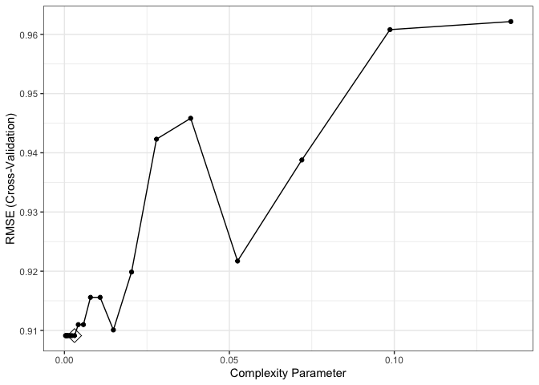<!-- -->

``` r
tree_fit$bestTune
```

    ##            cp
    ## 8 0.003059592

``` r
tree_fit$finalModel$cptable
```

    ##           CP nsplit rel error
    ## 1 0.34710828      0 1.0000000
    ## 2 0.18464743      1 0.6528917
    ## 3 0.05931585      2 0.4682443
    ## 4 0.03475635      3 0.4089284
    ## 5 0.03460901      4 0.3741721
    ## 6 0.02156368      5 0.3395631
    ## 7 0.02146995      6 0.3179994
    ## 8 0.00000000      7 0.2965295

``` r
rpart.plot(tree_fit$finalModel)
```

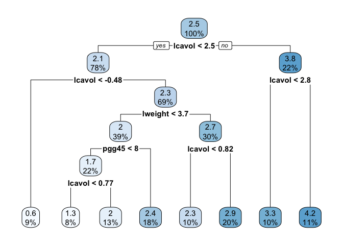<!-- -->

The tree size corresponds to the lowest cross-validation error is 8.

### The 1 SE rule

``` r
set.seed(2020) 

tree_fit_2 = train(lpsa~., 
            data = Prostate,
            method = "rpart",
            tuneGrid = data.frame(cp =exp(seq(-8,-2, length = 20))),
            trControl = trainControl(method = "cv",
                                     number = 10,
                                     selectionFunction = "oneSE"))

ggplot(tree_fit_2, highlight = TRUE)
```

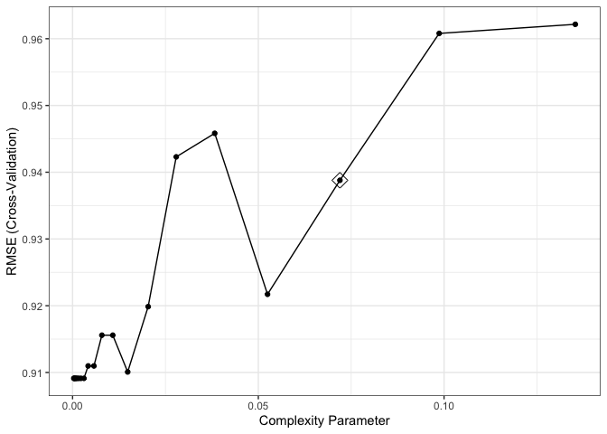<!-- -->

``` r
tree_fit_2$finalModel$cptable
```

    ##           CP nsplit rel error
    ## 1 0.34710828      0 1.0000000
    ## 2 0.18464743      1 0.6528917
    ## 3 0.07196474      2 0.4682443

``` r
rpart.plot(tree_fit_2$finalModel)
```

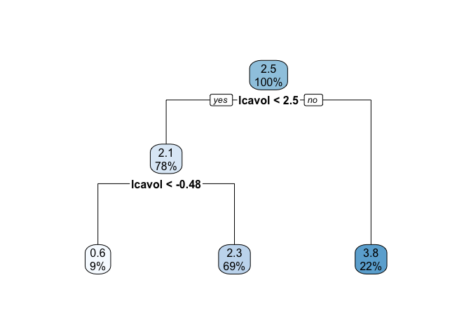<!-- -->

The tree size obtained using the 1 SE rule is 3.

**The two tree sizes obtained by different selection functions are
different.**

## b) Choose one decision tree model

``` r
resamp = resamples(list(lowest_cv_error = tree_fit, 
                         one_se = tree_fit_2
                         ))

bwplot(resamp, metric = "RMSE")
```

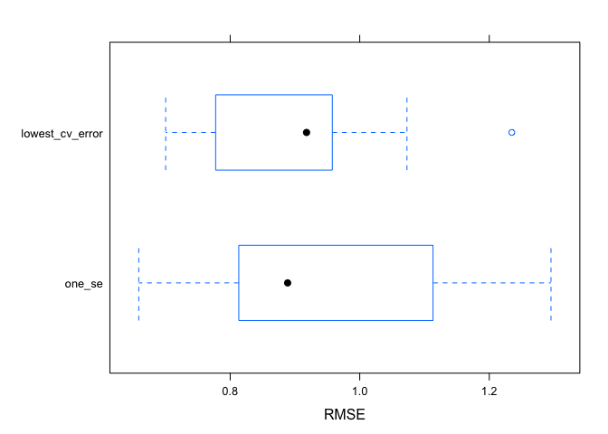<!-- -->

I choosed tree size 3 as it has a similar performance with size 8 and it
is simpler.

``` r
rpart.plot(tree_fit_2$finalModel)
```

<!-- -->

The first terminal node in the plot: When the lcavol is smaller than
-0.48 (firstly smaller than 2.5), the predicted value (or the mean of
observations in this terminal node) is 0.6. This terminal node contains
9% training data observations.

## c) Bagging

``` r
set.seed(2020)

bagging.grid = expand.grid(mtry = 8,
                       splitrule = "variance",
                       min.node.size = 1:30
                       )

bag_fit = train(lpsa~.,
                data = Prostate,
                method = "ranger",
                tuneGrid = bagging.grid,
                importance = "impurity",
                trControl = ctrl)

ggplot(bag_fit, highlight = T)
```

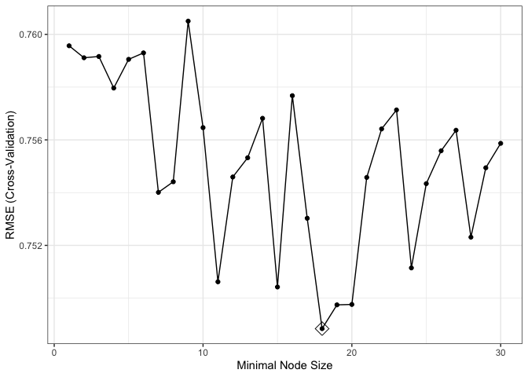<!-- -->

``` r
barplot(sort(ranger::importance(bag_fit$finalModel), 
             decreasing = FALSE),
        las = 2, horiz = TRUE, cex.names = 0.7,
        col = colorRampPalette(
            colors =c("darkred","white","darkblue"))(19))
```

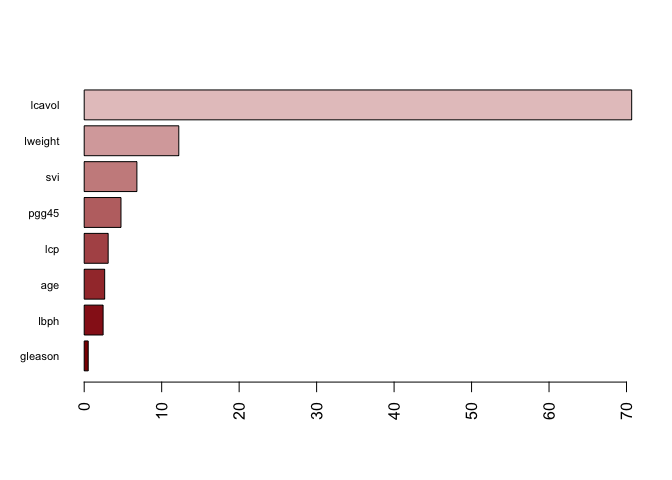<!-- -->

The lcavol is the most important variable in this bagging model.

Importance: lcavol \> lweight \> svi \> pgg45 \> lcp \> age \> lbph \>
gleason

## d) Random Forests

``` r
set.seed(2020)

rf.grid = expand.grid(mtry = 1:6,
                       splitrule = "variance",
                       min.node.size = 1:30
                       )

rf_fit = train(lpsa~.,
                data = Prostate,
                method = "ranger",
                tuneGrid = rf.grid,
                importance = "impurity",
                trControl = ctrl)

ggplot(rf_fit, highlight = T)
```

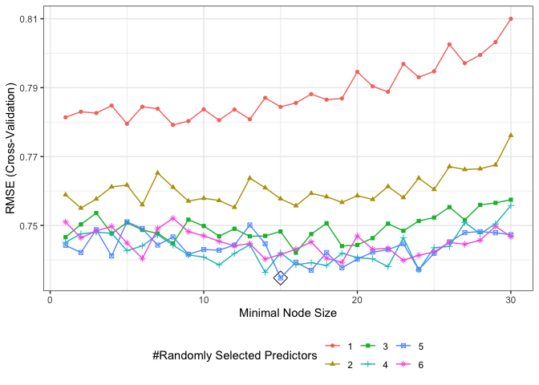<!-- -->

``` r
barplot(sort(ranger::importance(rf_fit$finalModel), 
             decreasing = FALSE),
        las = 2, horiz = TRUE, cex.names = 0.7,
        col = colorRampPalette(
            colors = c("darkred","white","darkblue"))(19))
```

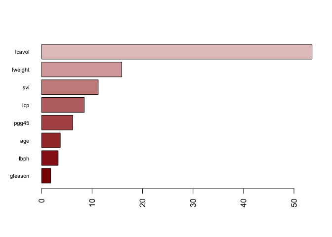<!-- -->

The lcavol is the most important variable in this random forests model.

Importance: lcavol \> lweight \> svi \> lcp \> pgg45 \> age \> lbph \>
gleason

## e) Boosting

``` r
set.seed(2020)

gbm.grid = expand.grid(
    n.trees = seq(1,5001, by = 500),
    interaction.depth = 1:10,
    shrinkage = c(0.001, 0.003, 0.005),
    n.minobsinnode = 1
    )

gbm_fit = train(lpsa~.,
                data = Prostate,
                method = "gbm",
                tuneGrid = gbm.grid,
                trControl = ctrl,
                verbose = FALSE)

ggplot(gbm_fit, highlight = T)
```

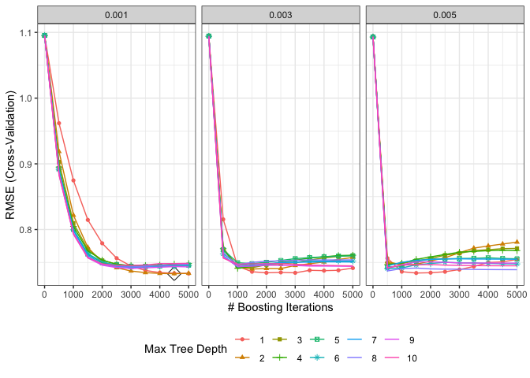<!-- -->

``` r
summary(gbm_fit$finalModel, las = 2, cBars = 19, cex.names = 0.6)
```

<!-- -->

    ##             var   rel.inf
    ## lcavol   lcavol 52.889150
    ## lweight lweight 18.401589
    ## svi         svi  7.423689
    ## lcp         lcp  6.096547
    ## pgg45     pgg45  6.069915
    ## age         age  5.043442
    ## lbph       lbph  2.722959
    ## gleason gleason  1.352709

The lcavol is the most important variable in this boosting model.

Importance: lcavol \> lweight \> svi \> lcp \> pgg45 \> age \> lbph \>
gleason

## f) Compare Models

``` r
resamp2 = resamples(list(tree_fit = tree_fit, 
                         tree_fit_1SE = tree_fit_2,
                         bagging = bag_fit,
                         rondomforest = rf_fit,
                         boosting = gbm_fit
                         ))
a = bwplot(resamp2, metric = "RMSE")
b = ggplot(resamp2, metric = "RMSE") 

gridExtra::grid.arrange(a,b,ncol = 2,nrow = 1)
```

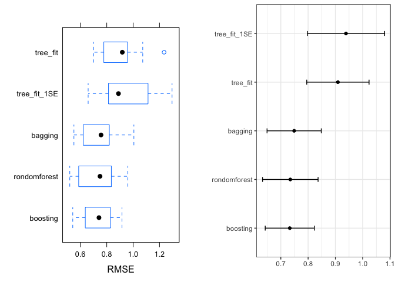<!-- -->

From the boxplots of RMSE in the cross-vaildation, we can see that
ensemble methods (bagging, random forerst and boosting) have a better
performance in the cross-vaildation than the simple decision tree model.
Comparing means of RMSE of different models in the cross-vaildation, we
choose the boosting model to predict PSA level as it has the lowest
mean.

## Homework 4 problem 2 Description

This problem involves the OJ data in the ISLR package. The data contains
1070 purchases where the customers either purchased Citrus Hill or
Minute Maid Orange Juice. A number of characteristics of customers and
products are recorded. Create a training set containing a random sample
of 800 observations, and a test set containing the remaining
observations. Use set.seed() for reproducible results.

## Problem 2

## a) Decision Tree

``` r
set.seed(2020)

train_ind = sample(seq_len(nrow(OJ)), size = 800)

training = OJ[train_ind, ]
test = OJ[-train_ind, ]
```

``` r
set.seed(2020)

ctrl2 = trainControl(method = "repeatedcv",
                    summaryFunction = twoClassSummary,
                    classProbs = TRUE)

tree_fit_c = train(Purchase~.,
                 data = training,
                 method = "rpart",
                 tuneGrid = data.frame(cp = exp(seq(-15,0, by = 2))),
                 trControl = ctrl2,
                 metric = "ROC"
                 )

plot(tree_fit_c, xTrans = function(x)log(x), xlab = "log(cp)")
```

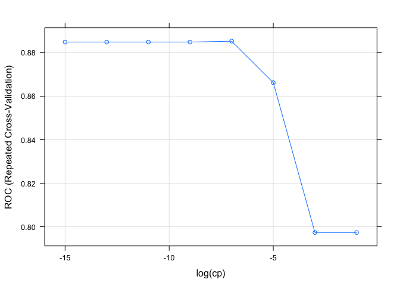<!-- -->

``` r
ggplot(tree_fit_c, highlight = T)
```

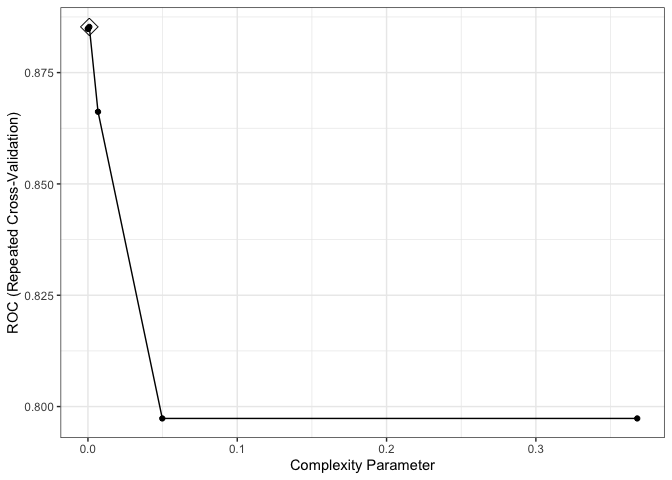<!-- -->

``` r
tree_fit_c$bestTune
```

    ##            cp
    ## 5 0.000911882

``` r
tree_fit_c$finalModel$cptable
```

    ##             CP nsplit rel error
    ## 1  0.486666667      0 1.0000000
    ## 2  0.035000000      1 0.5133333
    ## 3  0.030000000      3 0.4433333
    ## 4  0.013333333      4 0.4133333
    ## 5  0.010000000      6 0.3866667
    ## 6  0.006666667      7 0.3766667
    ## 7  0.004444444      9 0.3633333
    ## 8  0.003333333     12 0.3500000
    ## 9  0.001666667     13 0.3466667
    ## 10 0.000911882     15 0.3433333

### The plot of the final tree

``` r
rpart.plot(tree_fit_c$finalModel)
```

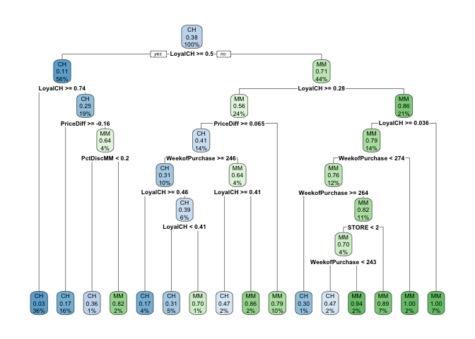<!-- -->

### Predict the response on the test data

``` r
tree.pred = predict(tree_fit_c, newdata = test, type = "raw")

1 - sum(tree.pred == test$Purchase) / length(test$Purchase)
```

    ## [1] 0.2222222

### Test classification error rate

The tree size is 16. The test classification error rate is 22.22% for
this tree model.

## b)Random forests

``` r
set.seed(2020)

rf.grid2 = expand.grid(mtry = 2:7,
                      splitrule = "gini",
                      min.node.size = seq(20,120, by = 10))

rf_fit_c = train(Purchase~.,
                 data = training,
                 method = "ranger",
                 tuneGrid = rf.grid2,
                 metric = "ROC",
                 trControl = ctrl2,
                 importance = "impurity")

ggplot(rf_fit_c, highlight = T)
```

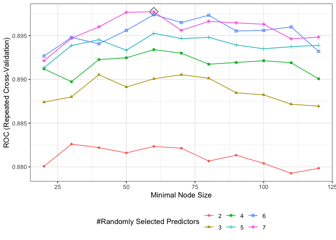<!-- -->

### Report variable importance

``` r
barplot(sort(ranger::importance(rf_fit_c$finalModel), 
             decreasing = FALSE),
        las = 2, horiz = TRUE, cex.names = 0.7,
        col = colorRampPalette(
            colors = c("darkred","white","darkblue"))(19))
```

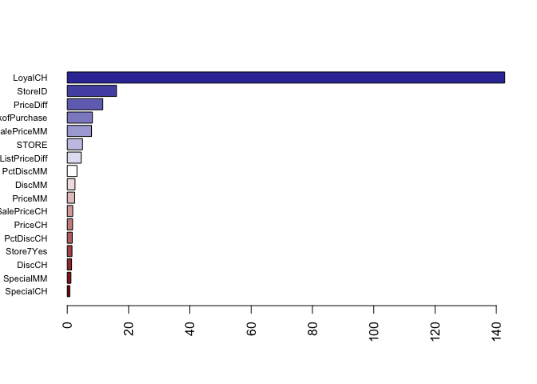<!-- -->

The loyalCH is the most important variable in this random forest model.

The top 5 most important variables: LoyalCH \> StoreID \> PriceDiff \>
WeekofPurchase \> SalePriceMM

### Predict the response on the test data

``` r
rf.pred = predict(rf_fit_c, newdata = test, type = "raw")

1 - sum(rf.pred == test$Purchase) / length(test$Purchase)
```

    ## [1] 0.1888889

### Test classification error rate

The test classification error rate is 18.89% for this random forest
model.

## c) Boosting

``` r
set.seed(2020)

gbm.grid2 = expand.grid(n.trees = seq(100, 600, by = 10),
                       interaction.depth = 2:6,
                       shrinkage = c(0.001, 0.003, 0.005),
                       n.minobsinnode = 1)

gbm_fit_c = train(Purchase~.,
                data = training,
                method = "gbm",
                trControl = ctrl2,
                distribution = "bernoulli",
                metric = "ROC",
                tuneGrid = gbm.grid2,
                verbose = F
                )

ggplot(gbm_fit_c, highlight = T)
```

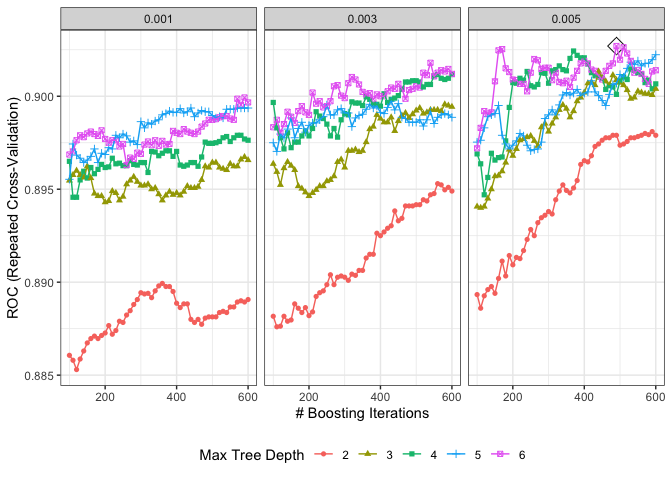<!-- -->

### Report variable importance

``` r
summary(gbm_fit_c$finalModel, las = 2, cBars = 19, cex.names = 0.6)
```

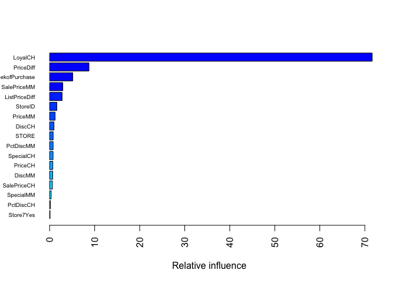<!-- -->

    ##                           var    rel.inf
    ## LoyalCH               LoyalCH 71.6453345
    ## PriceDiff           PriceDiff  8.7405234
    ## WeekofPurchase WeekofPurchase  5.1302524
    ## SalePriceMM       SalePriceMM  2.9255109
    ## ListPriceDiff   ListPriceDiff  2.7745226
    ## StoreID               StoreID  1.5965679
    ## PriceMM               PriceMM  1.2252798
    ## DiscCH                 DiscCH  0.9690714
    ## STORE                   STORE  0.7891423
    ## PctDiscMM           PctDiscMM  0.7772935
    ## SpecialCH           SpecialCH  0.7691108
    ## PriceCH               PriceCH  0.7125856
    ## DiscMM                 DiscMM  0.6929432
    ## SalePriceCH       SalePriceCH  0.6244650
    ## SpecialMM           SpecialMM  0.3479619
    ## PctDiscCH           PctDiscCH  0.1737719
    ## Store7Yes           Store7Yes  0.1056629

The loyalCH is the most important variable in this boosting model.

The top 5 most important variables: LoyalCH \> PriceDiff \>
WeekofPurchase \> SalePriceMM \> ListPriceDiff

### Predict the response on the test data

``` r
gbm.pred = predict(gbm_fit_c, newdata = test, type = "raw")
1 - sum(gbm.pred == test$Purchase) / length(test$Purchase)
```

    ## [1] 0.1851852

### Test classification error rate

The test classification error rate is 18.52% for this boosting model.
